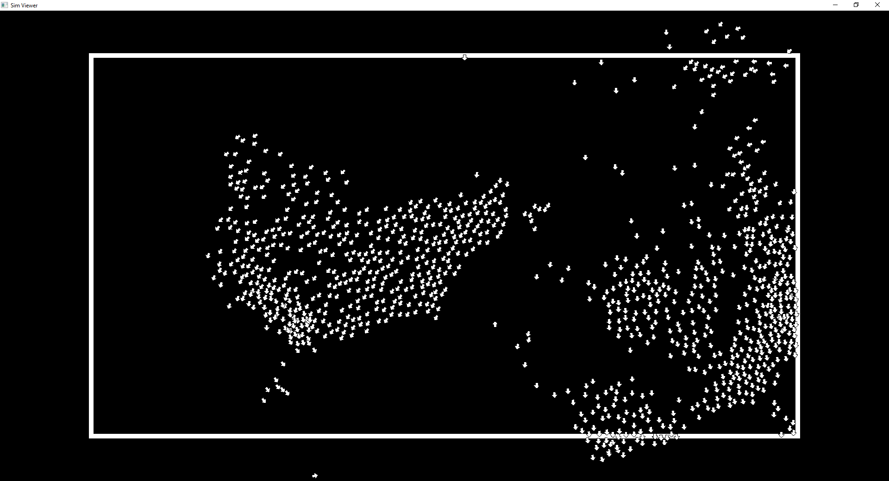

# Boids - Simulator 

Boids-Simulator is an SFML/CUDA-based simulation based around bird-oid objects.

Usage: 

To run the simulation, download 'Boids-Simulation.exe.' Ensure that you have an Nvidia GPU before running.

The source code is available under the source folder, /Simulator/.

For more on Boids Simulations, check [here](https://en.wikipedia.org/wiki/Boids)
